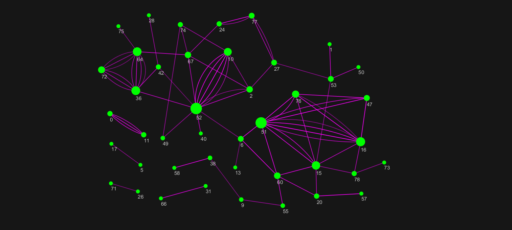
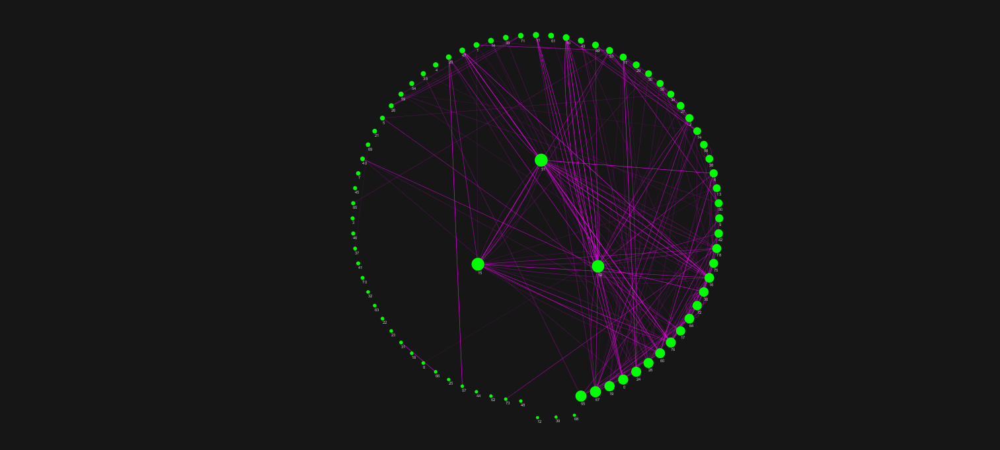

# SCDVによるベクトル表現を用いた文章間の参照ネットワーク可視化  

作者：konkon

## 概要

文章同士の相互関係を、それぞれの文の表現ベクトルのcos類似度で比較して参照関係をネットワーク化するプログラム。  
要するに文章間の相互参照関係(＝コピペ関係)を可視化するやつ。

## 動作環境

動作環境は以下の通り。  

OS Windows10 64bit  
CPU Intel i7-7700  
GPU NVIDIA GeForce GTX1070  
Memory: 16 GB  

Python及び必要パッケージのバージョンは以下の通りです。  
  
Python == 3.6.5  
numpy==1.14.5  
pandas==0.23.1  
matplotlib==2.2.2  
mecab-python-windows==0.996.1  
networkx==2.3  
python-docx==0.8.10  
gensim==3.4.0  
scikit-learn==0.19.1  
  
environments.txtに必要なパッケージ(MeCab以外)は記載してあります。  
以下のようにまとめてインストールできます。  
  
　$ pip install -r environments.txt  

Mecabのインストール方法は以下を参照してください。  
[PythonとMeCabで形態素解析(on Windows) --Qiita](https://qiita.com/menon/items/f041b7c46543f38f78f7)  

## 使い方

1. document/に、レポート文書([学籍番号].docx)を入れてください。.doc(古いWordの保存形式)には対応してません。.docxに変換してから入れてください。  

2. 事前学習モデルを用意してください。自分は[白ヤギコーポレーション](http://aial.shiroyagi.co.jp/2017/02/japanese-word2vec-model-builder/)さんからダウンロードしました。解凍後出てきたファイルはすべて pretrained_model/の中に入れてください。  

3. コマンドプロンプトを開き、上記のパッケージがインストールされたPython環境を有効にしてください。

4. このディレクトリ(CopyPasteNetwork/) に移動し、以下のコマンドでプログラムを実行します。  
  
　　$ python main.py document [threshold]  
  
　　thresholdには関連性を判別するcos類似度の閾値(0~1)を入力してください。0.8程度を推奨します。  

5. はじめてプログラムを実行する場合は事前学習モデルに対して追加学習を行います。追加学習後のモデルは model/ に保存されます。二度目以降にプログラムを実行し、modelに学習モデルが存在する場合は追加学習を行いません。  

6. 検出されたネットワーク構造は  
  
	result_(sim=[threshold]).csv  
	network_(sim=[threshold]).json  
  
　　として保存されます。  
　　あとは煮るなり焼くなり好きにどうぞ。  

7. JSONファイルはグラフ描画ソフト[Cytoscape](https://cytoscape.org/)で開けます。サンプルは以下。

## ネットワーク図サンプル

threshold == 0.8の場合のネットワーク図  

threshold == 0.6の場合のネットワーク図  
エッジのアルファ値が文の類似度、ノードのサイズが相互参照の数を表す。  
(ネットワーク図はCytoscapeにて作成)  

## ディレクトリ構成

CopyPasteNetwork/ (ここ)
│  
├ document/ (学習, 解析対象の.docxドキュメントを保存)  
│　│  
│　├ ********.docx  
│　├ ********.docx  
│　　　：  
│  
├ pretrained_model/ (事前学習モデルはここに入れる)  
│　│  
│　├ word2vec.gensim.model  
│　├ word2vec.gensim.model.syn1neg.npy  
│　└ word2vec.gensim.model.wv.syn0.npy  
│  
│　↑[http://aial.shiroyagi.co.jp/2017/02/japanese-word2vec-model-builder/]  
│　　からダウンロード  
│  
├ model/ (再学習したWord2Vecモデルはここに入る)  
│　│  
│　├ *****.model  
│　├ *****.syn1neg.npy  
│　└ *****.wv.syn0.npy  
│  
├ stopword.txt  
│ 文章解析の際に不必要となる語句のリスト。(例：工学研究科)  
│ 必要に応じて書き加えてください。  
│  
├ environment.txt  
│ 必要となるPythonパッケージのリストです。  
│  
└ readme.txt  
　 このテキストです。  
  

作者: konkon

Twitter: https://twitter.com/konkon28983820  
E-mail: velvetteen.rabbit@gmail.com  
GitHub: https://github.com/konkon3249  
Qiita: https://qiita.com/kon2  

Copyright (c) 2019 konkon. 